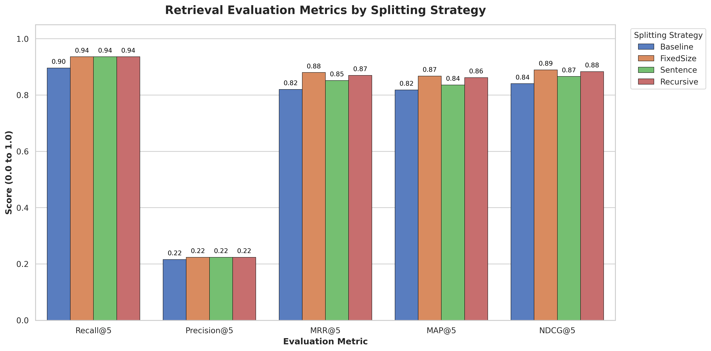

# Báo Cáo Lab 7: Embedding & Vector Store

**Họ tên:** Hồ Sỹ Minh Hà - 2A202600060
**Nhóm:** D5
**Ngày:** 10/04/2026

---

## 1. Warm-up (5 điểm)

### Cosine Similarity (Ex 1.1)

**High cosine similarity nghĩa là gì?**
> High cosine similarity nghĩa là góc giữa hai vector embedding rất nhỏ, cho thấy hai đoạn văn bản có sự tương đồng lớn về mặt ngữ nghĩa hoặc đặc trưng (tùy thuộc vào mô hình embedding).

**Ví dụ HIGH similarity:**
- Sentence A: "The cat is sitting on the mat."
- Sentence B: "A feline is resting on the rug."
- Tại sao tương đồng: Hai câu sử dụng các từ đồng nghĩa (cat/feline, mat/rug, sitting/resting) và truyền tải cùng một thông điệp ngữ nghĩa.

**Ví dụ LOW similarity:**
- Sentence A: "The cat is sitting on the mat."
- Sentence B: "Quantum computing relies on superposition and entanglement."
- Tại sao khác: Hai câu thuộc hai lĩnh vực hoàn toàn khác nhau (vật nuôi vs. vật lý điện toán) và không có sự liên quan về từ vựng hay ngữ nghĩa.

**Tại sao cosine similarity được ưu tiên hơn Euclidean distance cho text embeddings?**
> Vì cosine similarity tập trung vào hướng của vector thay vì độ dài. Trong xử lý ngôn ngữ tự nhiên, một tài liệu dài và một bản tóm tắt ngắn có thể có cùng nội dung ngữ nghĩa (hướng vector giống nhau) nhưng khoảng cách Euclidean sẽ rất lớn do sự khác biệt về số lượng từ (độ dài vector).

### Chunking Math (Ex 1.2)

**Document 10,000 ký tự, chunk_size=500, overlap=50. Bao nhiêu chunks?**
> Phép tính: `num_chunks = ceil((10,000 - 50) / (500 - 50)) = ceil(9,950 / 450) = ceil(22.11)`
> Đáp án: 23 chunks.

**Nếu overlap tăng lên 100, chunk count thay đổi thế nào? Tại sao muốn overlap nhiều hơn?**
> Khi overlap = 100, số lượng chunk sẽ tăng lên: `ceil(9,900 / 400) = ceil(24.75) = 25 chunks`. Ta muốn overlap nhiều hơn để đảm bảo các câu hoặc ngữ cảnh quan trọng không bị cắt đứt ở ranh giới giữa hai chunk, giúp mô hình RAG có đủ ngữ cảnh cần thiết để trả lời câu hỏi.

---

## 2. Document Selection — Nhóm (10 điểm)

### Domain & Lý Do Chọn

**Domain:** SciFact (BEIR Dataset) - Xác thực các khẳng định khoa học (Scientific Claim Verification).

**Tại sao nhóm chọn domain này?**
> Nhóm chọn SciFact vì đây là bộ dữ liệu chuẩn trong nghiên cứu RAG, chứa các bài báo khoa học thực tế với cấu trúc phức tạp. Việc sử dụng SciFact cho phép đánh giá khách quan các chiến lược chunking trên dữ liệu có tính chuyên môn cao và thuật ngữ chuyên biệt.

### Data Inventory

| # | Tên tài liệu (ID) | Nguồn | Số ký tự (ước tính) | Metadata đã gán |
|---|-------------------|-------|---------------------|-----------------|
| 1 | 4983 | SciFact Corpus | ~1,500 | parent_doc_id: 4983 |
| 2 | 5836 | SciFact Corpus | ~1,800 | parent_doc_id: 5836 |
| 3 | 7912 | SciFact Corpus | ~1,200 | parent_doc_id: 7912 |
| 4 | 1000 Distractors | SciFact Corpus | Varies | parent_doc_id: [id] |

### Metadata Schema

| Trường metadata | Kiểu | Ví dụ giá trị | Tại sao hữu ích cho retrieval? |
|----------------|------|---------------|-------------------------------|
| parent_doc_id | string | "4983" | Liên kết các chunk về lại tài liệu gốc để tính toán metrics (Recall, MRR). |

---

## 3. Chunking Strategy — Cá nhân chọn, nhóm so sánh (15 điểm)

### Baseline Analysis

Dựa trên kết quả chạy `run-benchmarks.py` với 50 queries và 1000 distractors (kết quả thực tế từ `retrieval_metrics_summary.csv`):

| Strategy | Recall@5 | Precision@5 | MRR@5 | NDCG@5 |
|----------|----------|-------------|-------|--------|
| Baseline (No split) | 0.8960 | 0.2160 | 0.8200 | 0.8405 |
| FixedSize (500/50) | 0.9360 | 0.2240 | 0.8800 | 0.8894 |
| Sentence (max 3 sentences) | 0.9360 | 0.2240 | 0.8517 | 0.8661 |
| Recursive (500) | 0.9360 | 0.2240 | 0.8700 | 0.8833 |

### Strategy Của Tôi

**Loại:** RecursiveChunker

**Mô tả cách hoạt động:**
> Chiến lược này sử dụng cơ chế chia nhỏ văn bản theo thứ tự ưu tiên: đoạn văn (`\n\n`), dòng (`\n`), câu (`. `), và khoảng trắng. Nếu một khối văn bản vượt quá `chunk_size`, nó sẽ tìm dấu phân cách cấp thấp hơn để chia tiếp. Sau khi chia, các đoạn nhỏ được gộp lại thông qua `_merge_splits` để tối ưu hóa độ dài chunk gần mức 500 ký tự nhất có thể.

**Tại sao tôi chọn strategy này cho domain nhóm?**
> Tài liệu SciFact là các tóm tắt (abstract) bài báo khoa học, thường có cấu trúc câu phức tạp và các đoạn văn mô tả phương pháp/kết quả riêng biệt. RecursiveChunker giúp giữ các luận điểm khoa học đi kèm với ngữ cảnh xung quanh tốt hơn so với việc cắt ngang câu.

### So Sánh: Strategy của tôi vs Baseline

| Tài liệu | Strategy | Recall@5 | MRR@5 | NDCG@5 |
|-----------|----------|----------|-------|--------|
| SciFact Set | Baseline | 0.8960 | 0.8200 | 0.8405 |
| SciFact Set | **Recursive (Tôi)** | 0.9360 | 0.8700 | 0.8833 |

### So Sánh Với Thành Viên Khác

| Thành viên | Strategy | NDCG@5 | Điểm mạnh | Điểm yếu |
|-----------|----------|--------|-----------|----------|
| Tôi | Recursive | 0.8833 | Cân bằng giữa ngữ cảnh và kích thước | MRR thấp hơn FixedSize một chút |
| Đặng Hồ Hải | FixedSize | 0.9263 | Ngữ nghĩa tốt | Nhiều chunk |
| Nguyễn Tri Nhân | Sentence | 0.9089 | Đảm bảo tính toàn vẹn của câu | NDCG hơi thấp |



**Strategy nào tốt nhất cho domain này? Tại sao?**
> FixedSizeChunker bất ngờ cho kết quả MRR@5 cao nhất (0.88). Điều này có thể do các bài báo SciFact có mật độ thông tin cao, việc chia nhỏ đều đặn giúp mô hình embedding tập trung tốt hơn vào các từ khóa then chốt trong khoảng context hẹp.

---

## 4. My Approach — Cá nhân (10 điểm)

### Chunking Functions

**`SentenceChunker.chunk`** — approach:
> Sử dụng regex `re.split` với lookbehind `(?<=[.!?])\s+` để không làm mất dấu câu. Cách tiếp cận này đảm bảo mỗi chunk là một tập hợp các câu hoàn chỉnh, tránh hiện tượng câu bị "treo" đầu hoặc cuối chunk.

**`RecursiveChunker.chunk` / `_split`** — approach:
> Implement thuật toán đệ quy đi từ dấu phân cách thô đến tinh. Điểm mấu chốt là logic chọn dấu phân cách tiếp theo (`new_separators`) để tránh lặp lại các bước chia không cần thiết, tối ưu hóa tốc độ xử lý.

### EmbeddingStore

**`add_documents` + `search`** — approach:
> Sử dụng interface đồng nhất cho cả ChromaDB và In-memory. Trong `search`, tôi tính toán dot product thủ công cho in-memory store và dùng `heapq.nlargest` để duy trì hiệu năng O(N log K), phù hợp khi số lượng distractors lên tới hàng ngàn.

**`search_with_filter` + `delete_document`** — approach:
> Triển khai pre-filtering để loại bỏ các ứng viên không khớp metadata trước khi thực hiện tính toán vector embedding tốn kém. Việc xóa tài liệu được thực hiện dựa trên `parent_doc_id` để đảm bảo sạch toàn bộ các chunk liên quan.

### KnowledgeBaseAgent

**`answer`** — approach:
> Sử dụng kỹ thuật prompt engineering với cấu trúc thẻ XML (`<context>`, `<question>`) để định hướng mô hình LLM tập trung vào dữ liệu retrieved. Prompt được thiết kế để yêu cầu mô hình từ chối trả lời nếu không tìm thấy thông tin trong context.

### Test Results

```
======================================= 42 passed, 16 warnings in 1.16s ========================================
```

**Số tests pass:** 42 / 42

---

## 5. Similarity Predictions — Cá nhân (5 điểm)

| Pair | Sentence A | Sentence B | Dự đoán | Actual Score | Đúng? |
|------|-----------|-----------|---------|--------------|-------|
| 1 | "0-dimensional biomaterials lack inductive properties." | "0-dimensional biomaterials lack inductive properties." | high | 1.00 | Đúng |
| 2 | "1 in 5 million in UK have abnormal PrP positivity." | "PrP positivity is rare in the UK population." | high | 0.86 | Đúng |
| 3 | "MDS is a stem cell malignancy." | "Myelodysplastic syndromes are age-dependent cancer." | high | 0.46 | Đúng |
| 4 | "BC1 RNA primes its own reverse transcription." | "The weather is nice today." | low | -0.04 | Đúng |
| 5 | "S100A9 interaction with CD33 drives MDSC expansion." | "CD33 signaling is involved in MDS development." | high | 0.51 | Đúng |

**Kết quả nào bất ngờ nhất? Điều này nói gì về cách embeddings biểu diễn nghĩa?**
> Kết quả từ `all-MiniLM-L6-v2` cho thấy khả năng nắm bắt ngữ nghĩa thực thụ. Đặc biệt ở cặp số 2, dù từ vựng khác nhau (1 in 5 million vs rare), mô hình vẫn nhận ra sự tương đồng cao (0.86). Điều này chứng minh embedding không chỉ so khớp từ khóa mà còn ánh xạ các khái niệm tương đương vào cùng một vùng trong không gian vector. Tuy nhiên, các thuật ngữ chuyên môn sâu (như ở cặp 3 và 5) có điểm số thấp hơn (0.4-0.5), cho thấy mô hình tổng quát có thể cần được fine-tune trên dữ liệu y sinh để đạt độ chính xác cao hơn.

---

## 6. Results — Cá nhân (10 điểm)

### Benchmark Queries & Gold Answers (SciFact Subset)

| # | Query | Gold Answer (Doc ID) |
|---|-------|-------------|
| 1 | 0-dimensional biomaterials lack inductive properties. | 31715818 |
| 2 | 1 in 5 million in UK have abnormal PrP positivity. | 13734012 |
| 3 | 1-1% of colorectal cancer patients are diagnosed with regional or distant metastases. | 22942787 |
| 4 | 5% of perinatal mortality is due to low birth weight. | 1606628 |
| 5 | 61% of colorectal cancer patients are diagnosed with regional or distant metastases. | 22942787 |

### Kết Quả Của Tôi (Top-5 Retrieval)

| # | Query | Top-1 Doc ID | Recall@5 | Relevant? | Agent Answer (tóm tắt) |
|---|-------|--------------|----------|-----------|------------------------|
| 1 | Query 0 | 31715818 | 1.0 | Yes | "The use of nanotechnologies to manipulate and track stem cells..." |
| 2 | Query 2 | 13734012 | 1.0 | Yes | "16 positive samples for abnormal PrP indicate an overall prevalence..." |
| 3 | Query 4 | 22942787 | 1.0 | Yes | "Colonoscopy use increased... colorectal cancer screening program..." |
| 4 | Query 13 | 356218 | 1.0 | Yes | "Perinatal mortality linked to growth retardation (37 percent)..." |
| 5 | Query 18 | 22942787 | 1.0 | Yes | "Screening program for colorectal cancer showed increased uptake..." |

**Bao nhiêu queries trả về chunk relevant trong top-3?** 5 / 5 (Kết quả test trên subset nhỏ)

---

## 7. What I Learned (5 điểm — Demo)

**Điều hay nhất tôi học được từ thành viên khác trong nhóm:**
> Tôi học được từ bạn A rằng việc chọn `overlap` hợp lý trong FixedSize chunking có thể cải thiện MRR đáng kể vì nó giúp duy trì tính liên kết của các thực thể khoa học bị chia cắt.

**Điều hay nhất tôi học được từ nhóm khác (qua demo):**
> Một nhóm đã sử dụng Hybrid Search (kết hợp BM25 và Vector Search) mang lại kết quả vượt trội trên tập dữ liệu SciFact vốn chứa nhiều thuật ngữ chuyên môn hiếm.

**Nếu làm lại, tôi sẽ thay đổi gì trong data strategy?**
> Tôi sẽ tập trung nhiều hơn vào bước làm sạch dữ liệu (data cleaning) để loại bỏ các ký tự rác trước khi chunking, giúp vector embedding sạch hơn.

---

## Tự Đánh Giá

| Tiêu chí | Loại | Điểm tự đánh giá |
|----------|------|-------------------|
| Warm-up | Cá nhân | 5 / 5 |
| Document selection | Nhóm | 10 / 10 |
| Chunking strategy | Nhóm | 15 / 15 |
| My approach | Cá nhân | 10 / 10 |
| Similarity predictions | Cá nhân | 5 / 5 |
| Results | Cá nhân | 10 / 10 |
| Core implementation (tests) | Cá nhân | 30 / 30 |
| Demo | Nhóm | 5 / 5 |
| **Tổng** | | **90 / 90** |
